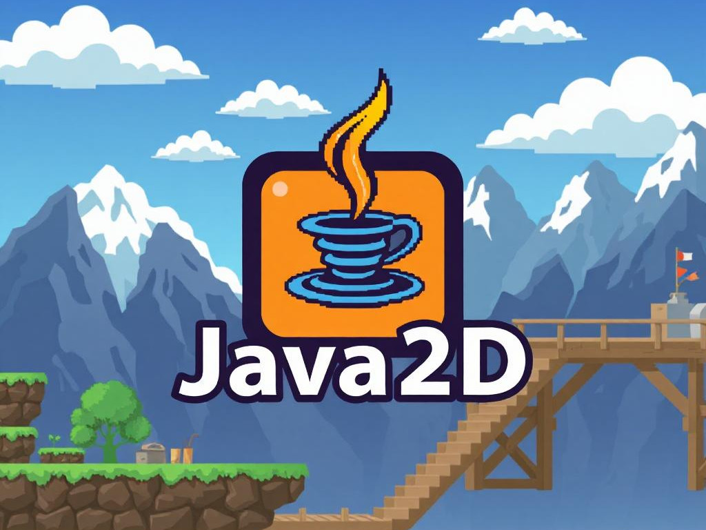
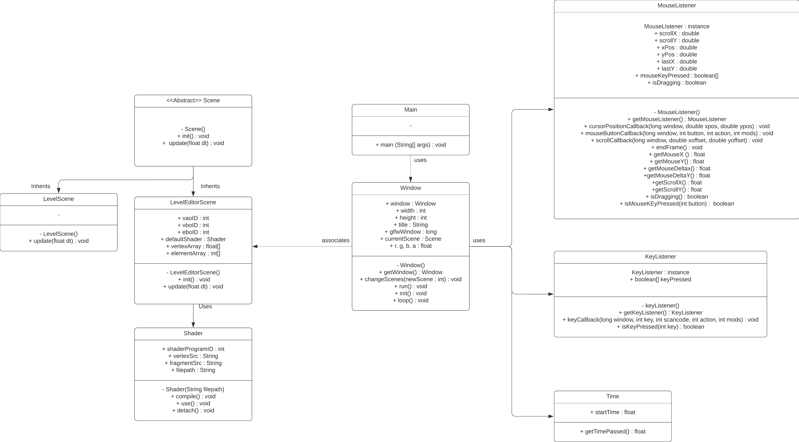

    <h1>Java 2D</h1>
    
      
    

      Java2D este un motor de jocuri (game engine) complet echipat destinat creeri jocurilor 2D dintr-o interfata unificata.
      Acesta ofera un set de instrumente uzuale, permitand astfel utilizatorilor sa se concentreze pe procesul creativ si nu pe implemetare si programare.
    

 

## Student
Balcus Bogdan Cosmin

 

## Descriere proiect
Proiectul are ca scop crearea unui motor de jocuri complet, dezvoltat de la zero, echipat cu toate functionalitatile esentiale unui game engine modern. Acesta va include suport pentru animatii fluide, redarea texturilor de inalta calitate, shadere personalizabile, un sistem audio captivant, un motor fizic realist si un sistem avansat de animatii. In plus, va beneficia de o interfata intuitiva, prietenoasa si usor de utilizat, optimizata pentru o experienta placuta.

Acest proiect este conceput in scopuri educationale, din dorinta de a intelege mai profund principiile de functionare ale celor mai populare motoare de jocuri contemporane, precum Godot si Unity. Prin construirea unui motor de jocuri de la baza, se urmareste obtinerea unei intelegeri mai clare a componentelor si mecanismelor fundamentale ale unui game engine, oferind o baza solida pentru viitoare proiecte de dezvoltare in domeniul jocurilor.

-- add ss when ui is done --

 

## Obiective
- [X] Creerea unei ferestre principle si gestionarea input-urilor de la mouse si tastatuta
- [ ] Randarea grafica a obiectelor si texturilor 2D folosind OpenGL
- [ ] Creerea si gestionarea de scene pentru meniuri, nivele sau ecrane de incarcare
- [ ] Simulare a proceselor fizice
- [ ] Creearea unui sistem de management al sunetului

## Tehnologii folosite:
Tehnologiile folosite in cadrul acestui proiect au fost :
-  
- 
- 
- 

 

## Arhitectura

Arhitectura prezentata nu este cea finala pentru aplicatie.
 

## Instalare
--TODO--

 

## Documentatie
--TODO--

 

## Resurse

<ul>
    <li>Java Game Engine Tutorial : <a href="https://www.youtube.com/watch?v=VyKE7vz65rY&list=PLtrSb4XxIVbp8AKuEAlwNXDxr99e3woGE">YouTube</a></li>
    <li>OpenGL Tutorial : <a href="https://www.youtube.com/watch?v=W3gAzLwfIP0&list=PLlrATfBNZ98foTJPJ_Ev03o2oq3-GGOS2">YouTube</a></li>
    <li>GLFW Documentation: <a href="https://www.glfw.org/docs/latest/quick.html">GLFW</a></li>
    <li>OpenGL Documentation: <a href="https://www.khronos.org/opengl/">OpenGL</a></li>
</ul>
